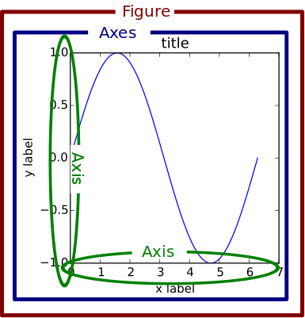

# Python Plotting With Matplotlib (Guide)

https://realpython.com/python-matplotlib-guide/

## History of matplotlib

- matplotlib originally inspired to emulate commands from Mathworks' MATLAB software
- One relevant feature of MATLAB is its global style
- `pylab` is a module within the matplotlib library that was built to mimic MATLAB's global style. It exists only to bring a number of functions and classes from both NumPy and matplotlib into the namespace
- [pylab] still exists for historical reasons, but it is highly advised NOT to use. 

## The Matplotlib Object Hierarchy



- `Figure`: the outermost container for a matplotlib graphic, which can contain multiple `Axes` objects.
- `Axes`: (actual plots) actually translates into what we think of as an individual plot or graph (rather than the plural of "axis," as we might expect).

```py
>>> fig, _ = plt.subplots()
>>> type(fig)
<class 'matplotlib.figure.Figure'>
```

## Stateful vs. Stateless (object-oriented) Approaches

- Almost all functions from pyplot, such as `plt.plot()`, are implicitly either referring to an _existing current Figure and current Axes_, or _creating them anew if none exist_.

> "[With pyplot], simple functions are used to add plot elements (lines, images, text, etc.) to the current axes in the current figure."

- Stateful: There is only ever one `Figure` or `Axes` that you're manipulating at a given time, and you don't need to explicitly refer to it.
- Stateless: Calling methods of an `Axes` object

**Examples**

- `plt.stacklot()` = `gca().stacklot()`
- `plt.title()` = `gca().set_title()`
- ``plt.ylabels()` = `gca().set_ylable()`

```py
# matplotlib/pyplot.py
>>> def plot(*args, **kwargs):
...     """An abridged version of plt.plot()."""
...     ax = plt.gca()
...     return ax.plot(*args, **kwargs)

>>> def gca(**kwargs):
...     """Get the current Axes of the current Figure."""
...     return plt.gcf().gca(**kwargs)
```

## Understanding `plt.subplots()` Notation

- `fig, ax = plt.subplots()` (default call is `subplots(nrows=1, ncols=1)`)
- `ax` can be either a single `matplotlib.axes.Axes` object or an array of `Axes` objects if more than one subplot was created.
- `plt.subplot2grid()` or `plt.gridspec()` or `plt.subplots()`, for multiple plots in grid.

```py
fig, ax = plt.subplots(nrows=2, ncols=2, figsize=(7, 7))
ax1, ax2, ax3, ax4 = ax.flatten()  # flatten a 2d NumPy array to 1d
```

## The "Figures" Behind The Scenes

- Each time you call `plt.subplots()` or the less frequently used `plt.figure()` (which creates a Figure, with no Axes), you are creating a new `Figure` object that matplotlib sneakily keeps around in memory.
- `plt.get_fignums()` returns fig corresponding ID number, then `plt.figure(num)`
- `plt.close(num)` closes the figure number `num`, and `plt.close('all')` closes all the figure windows

```py
>>> fig1, ax1 = plt.subplots()

>>> id(fig1)
4525567840

>>> id(plt.gcf())  # `fig1` is the current figure.
4525567840

>>> fig2, ax2 = plt.subplots()
>>> id(fig2) == id(plt.gcf())  # The current figure has changed to `fig2`.
True
```

## Appendix A: Configuration and Styling

Matplotlib offers two ways to configure style in a uniform way across different plots:

1. By customizing a [matplotlibrc](https://matplotlib.org/users/customizing.html) file
2. By changing your configuration parameters interactively, or from a .py script.
    - When you import matplotlib.pyplot as plt, you get access to an `rcParams` object that resembles a Python dictionary of settings.
    - `plt.rc('lines', linewidth=2, color='r')  # Syntax 1`
    - `plt.rcParams['lines.linewidth'] = 2  # Syntax 2`
    - `plt.style.available`, `plt.style.use('fivethirtyeight')`
